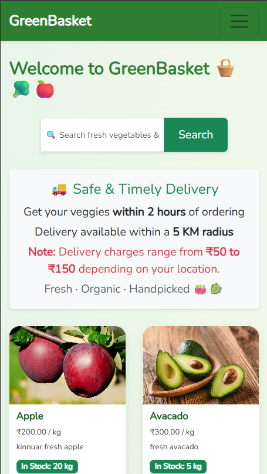
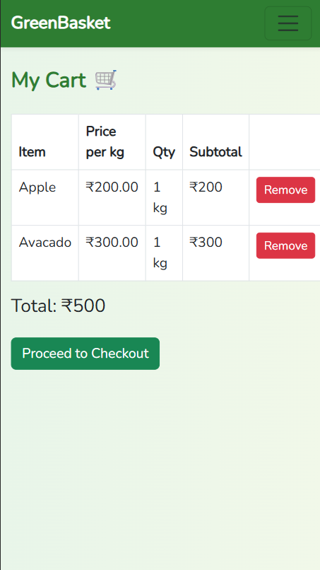
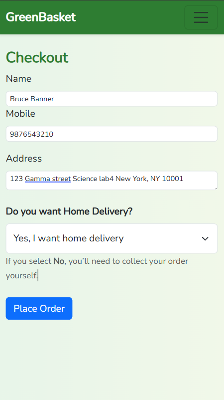
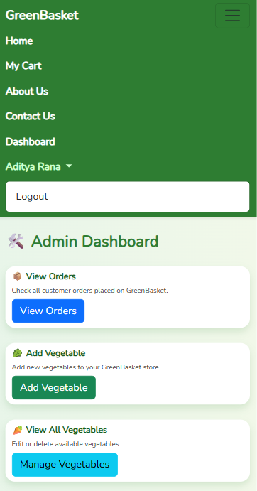
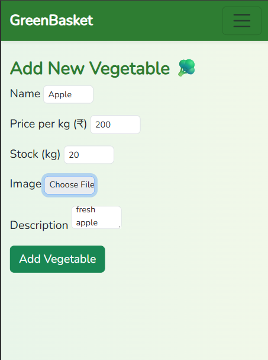
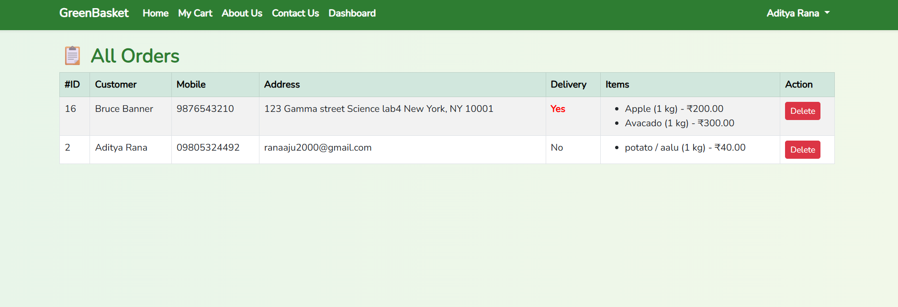

# 🥦 GreenBasket - Laravel Based Veggie Store

GreenBasket is a Laravel-based online vegetable store where customers can browse fresh vegetables, add them to a cart, and place orders by providing their delivery details. Admins can manage and track orders from the backend dashboard.

---

## 🌟 Features

- 🛒 Session-based Cart System  
- 📦 Order Placement with Name, Phone, and Address  
- ❌ Out of Stock Indicator for unavailable items  
- 🔐 Admin Panel to View Orders  
- 📱 Responsive UI using Blade & Bootstrap  
- 💚 Clean and minimal user experience

---

## 🖼️ Screenshots

### 🏠 Homepage

### 🛒 Cart Page

### 🧾 Checkout Page

### 🧾 About Page

### 📋 Admin Panel

### 📋 Admin Panel add veg

### 📋 Admin Order Panel

---

## 🛠️ Tech Stack

- **Framework**: Laravel 10  
- **Language**: PHP 8  
- **Database**: MySQL  
- **Frontend**: Blade Templates, Bootstrap 5  
- **Version Control**: Git & GitHub

---

## 📌 Author

Developed with ❤️ by [Aditya Rana](https://github.com/AdityaRana45)
